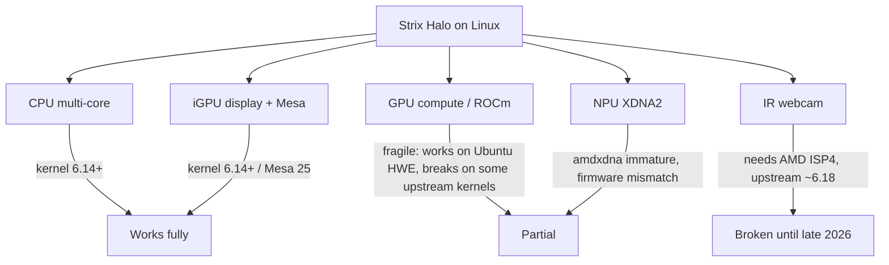

# AMD Strix Halo Laptops on Linux (2025-2026)

**Date:** 2026-06-02

**Strix Halo** (AMD Ryzen AI Max / Max+ 300 series) is AMD's big-APU platform: up to
16 Zen 5 cores, a large Radeon 8050S/8060S iGPU (32/40 CU, RDNA 3.5), an XDNA2 NPU, and —
the defining feature — a **256-bit LPDDR5X memory bus (~256 GB/s)** with up to 128 GB of
**unified** memory. It targets the workload this project does *not* optimize for (local LLM
inference, GPU compute, gaming-without-dGPU), but the top SKU also posts the highest
sustained multi-core CPU scores of anything in this research set.

This overview exists because Strix Halo keeps coming up as "the obvious AMD flagship." For
*sustained CPU work on a ≤1.6 kg Linux laptop*, it is mostly the wrong tool — but there is
exactly one exception worth buying.

## Why it usually fails this project's criteria

| Criterion | Strix Halo reality |
|-----------|--------------------|
| Weight ≤1.6 kg | Most are 1.6-1.77 kg gaming/workstation chassis; only the HP ZBook Ultra G1a (1.586 kg) and the ROG Flow Z13 tablet squeak under |
| Noise <45 dB(A) | High-power APU (45-120 W cTDP); reviewed units run 47-50 dBA under load |
| RAM type | **Soldered LPDDR5X only** — the 256-bit bus rules out SO-DIMM/LPCAMM2; capacity is a buy-time decision |
| Price | $2,300-$4,000 — far above the HX 370 field |
| Charger / docking | 140-200 W chargers exceed the 100 W dock PD ceiling — needs a ≥140 W dock (~$550), see [USB4 docking](./usb4-docking-linux.md) |

The CPU advantage is real (Max+ 395: ~30 k CB R23 multi sustained vs ~23 k for a well-cooled
HX 370), but you pay for it in weight, noise, soldered RAM, and price. The huge iGPU and
memory bandwidth are wasted on compilation/PySpark — they matter for local LLMs and GPU
compute. If you only need sustained *CPU* throughput, an HX 370/470 at 65 W (e.g.
[TUXEDO InfinityBook Pro 14](../reviews/tuxedo-infinitybook-pro-14.md)) gives ~75% of the
performance with upgradeable RAM, lower noise, and a third of the price.

## The laptop catalog (June 2026)

Laptop/clamshell/tablet form factors only. Mini-PCs and handhelds are listed separately.

| Model | Mfr | Form factor | Top SKU | Weight | RAM | Charger | Status | Notes |
|-------|-----|-------------|---------|--------|-----|---------|--------|-------|
| **[ZBook Ultra G1a 14](../reviews/hp-zbook-ultra-g1a.md)** | HP | clamshell workstation | Max+ PRO 395 | 1.586 kg | ≤128 GB LPDDR5X-8533 | 140 W | **available, Ubuntu-certified** | Best turnkey Linux; CB R23 ~29,200 sustained |
| **[ProArt PX13 GoPro (2026)](../reviews/asus-proart-px13.md)** | ASUS | convertible | Max+ 395 | **1.39 kg** | ≤128 GB LPDDR5X-8000 | 200 W | **available, reviewed** | Lightest reviewed Strix Halo; CB R23 30,403 (10-min); Linux fair (needs kernel 7.0 + speaker firmware) |
| **[ROG Flow Z13 (2025)](../reviews/asus-rog-flow-z13.md)** | ASUS | tablet | Max+ 395 | 1.24 kg (tablet) | ≤128 GB LPDDR5X | 200 W | not recommended | Overheating reports, inconsistent thermals |
| TUF Gaming A14 (FA401EA) | ASUS | gaming clamshell | Max+ 392 (12C) | 1.48 kg | ≤64 GB LPDDR5X-8533 | 200 W | **available, reviewed** | GB6 17,334 multi; no dGPU; no Linux validation yet |
| Yoga Pro 7a 15 | Lenovo | clamshell | Max+ 392 | ~1.5 kg | ≤128 GB LPDDR5X-8533 | 180 W | announced (June 2026, ~€2,499) | Wacom pad; 15.3" 2.5K OLED; vendor claims 22 dB |
| Legion 7a Gen 11 (15.3") | Lenovo | gaming clamshell | Max+ 388/392/395 | ~1.65 kg | ≤128 GB LPDDR5X-8533 | 180 W | announced (June 2026, ~€2,000) | iGPU-only Strix Halo; **the reviewed Legion 7a *16"* is Gorgon Point HX 470 + RTX, NOT Strix Halo** |
| MetaMech 16 | MetaMech | gaming clamshell | Max+ 395 | — | ≤128 GB LPDDR5X-8000 | — | China-only (~CNY 22,999) | OCuLink wired-eGPU port; no Western/Linux review |

**Not laptops** (for exclusion clarity): Framework Desktop, HP Z2 Mini G1a, GMKtec EVO-X2,
Minisforum MS-S1 Max, MSI AI Edge 4L (mini-PCs); GPD Win 5, AYANEO Next 2, OneXFly Apex
(handhelds). AMD did **not** ship a Strix Halo into any Tongfang/Clevo/TUXEDO/Schenker
**laptop** barebone — the soldered 256-bit LPDDR5X package is incompatible with the ODM
SO-DIMM model. There is no 16" ZBook Ultra and no Framework *laptop* on Strix Halo.

**No Chinese laptop barebones either (as of June 2026).** Standalone Max+ 395 chips are now
sold in China and AMD has shown "dozens" of Ryzen AI Max+ 395 designs there — but these are
**mini-PCs / AI Halo Box / Mini AI Workstations** (desktop barebones, e.g. GMKtec, Minisforum),
not laptop barebones. The only China-market Strix Halo *laptop* is the finished MetaMech 16,
not a whitebox barebone. The soldered memory rules out the SO-DIMM barebone model entirely.

### SKU map (Zen 5)

| SKU | Cores | iGPU | Memory BW | cTDP |
|-----|-------|------|-----------|------|
| Max+ 395 / PRO 395 | 16C/32T | Radeon 8060S (40 CU) | 256 GB/s | 45-120 W |
| Max+ 392 | 12C/24T | Radeon 8060S (40 CU) | 256 GB/s | 45-120 W |
| Max 390 / PRO 390 | 12C/24T | Radeon 8050S (32 CU) | 256 GB/s | 45-120 W |
| Max+ 388 | 8C/16T | Radeon 8060S (40 CU) | 256 GB/s | 45-120 W |
| Max 385 / PRO 385 | 8C/16T | Radeon 8050S (32 CU) | 256 GB/s | 45-120 W |

**Gorgon Halo** (Ryzen AI Max+ PRO 495, up to **192 GB** unified memory) is a half-step
refresh announced for later in 2026 — minimal CPU/GPU clock change, no confirmed laptop
models yet. See [cpu-comparison.md](../cpu-comparison.md) for the full SKU breakdown.

## Linux compatibility (platform-level)

**Baseline:** kernel **6.14+** and **Mesa 25.0+** give good out-of-box support — `amdgpu`
drives the Radeon 8060S (gfx1151) cleanly on Ubuntu 25.04 / Fedora 42. The HP ZBook Ultra
G1a is **Ubuntu 24.04 LTS certified**.

**What works:** CPU multi-core (full), display/Mesa graphics, Wi-Fi 7 MediaTek MT7925
(`mt7925e`), USB4/Thunderbolt, suspend (per Phoronix), LVFS/fwupd.

**Known gaps:**
- **IR webcam** — needs the AMD **ISP4** driver; not upstream until ~kernel 6.18. The one
  consistently-cited gap. Ubuntu 24.04 OEM kernels carry downstream patches.
- **NPU (XDNA2)** — in-tree `amdxdna` driver exists but is immature; shipped firmware is
  mismatched with toolchains (e.g. FastFlowLM). Not plug-and-play.
- **ROCm / GPU compute** — works but fragile on gfx1151: ROCm 6.4.1/7.0 run on the Ubuntu
  24.04 HWE stack but fail on some upstream 6.14/6.15 in-tree amdgpu builds. Open bugs:
  GPU hang combining compute + video encode, `amd-smi` reporting all-N/A telemetry.
- **Phoronix** found GPU compute leads Strix Point/Lunar Lake, but Blender HIP and
  llama.cpp were unstable at review time — AI/LLM GPU results were incomplete.

For **this project's CPU workloads** (kernel compilation, PySpark), none of the GPU/NPU/
webcam gaps matter — the CPU path is fully supported on kernel 6.14+.

## Bottom line

- **Two reviewed laptops now meet the weight criterion**, and they trade off Linux maturity
  vs portability/price:
  - **[HP ZBook Ultra G1a](../reviews/hp-zbook-ultra-g1a.md)** (1.586 kg, ~$4,000) — the
    **turnkey Linux** choice. Ubuntu-certified, CPU fully supported, CB R23 ~29,200 sustained.
    Noise (~48 dB peak, ~44–45 dB normal) is in the same class as the rest of this field.
  - **[ASUS ProArt PX13 GoPro](../reviews/asus-proart-px13.md)** (1.39 kg, ~$3,000) — lighter,
    cheaper, slightly *faster* (CB R23 30,403 over 10 min), but **Linux is fair**: needs a 7.0
    mainline kernel, boot params, and manual speaker-firmware extraction. A convertible with a
    60 Hz OLED.
- **TUF Gaming A14** (Max+ 392) is reviewed and light (1.48 kg) but has no Linux validation
  yet; **Legion 7a (15.3" Strix Halo), Yoga Pro 7a, and MetaMech 16** remain announced /
  region-locked / unreviewed on Linux.
- If you only need CPU throughput, an HX 370/470 at 65 W is the saner, cheaper, upgradeable
  choice — Strix Halo's real value is local LLM inference and GPU compute, not compilation.

## Sources

- [HP ZBook Ultra G1a NotebookCheck review](https://www.notebookcheck.net/HP-ZBook-Ultra-G1a-14-review-Powerful-MacBook-Pro-alternative-for-work-and-game.994758.0.html)
- [Phoronix HP ZBook Ultra G1a Linux review](https://www.phoronix.com/review/hp-zbook-ultra-g1a/2)
- [Phoronix Strix Halo ROCm GPU compute](https://www.phoronix.com/review/amd-strix-halo-rocm-benchmarks)
- [Ubuntu certification — AI Max+ PRO 395](https://ubuntu.com/certified/202411-36033/24.04%20LTS) · [AI Max 385](https://ubuntu.com/certified/202411-36043/24.04%20LTS)
- [AMD Ryzen AI Max+ 395 product page](https://www.amd.com/en/products/processors/laptop/ryzen/ai-300-series/amd-ryzen-ai-max-plus-395.html)
- [UltrabookReview Strix Halo laptops](https://www.ultrabookreview.com/70442-amd-strix-halo-laptops/) · [ProArt/TUF Strix Halo](https://www.ultrabookreview.com/74193-asus-strix-halo-laptops-proart-tuf/)
- [TechPowerUp Max+ 392/388 expansion](https://www.techpowerup.com/344786/amd-expands-ryzen-ai-max-strix-halo-processor-lineup)
- [MetaMech 16 (NotebookCheck)](https://www.notebookcheck.net/MetaMech-releases-new-16-inch-gaming-laptop-with-OCuLink-and-up-to-96-GB-VRAM.1268938.0.html)
- [Lenovo Legion 7 15ASH11 (TechPowerUp)](https://www.techpowerup.com/345635/lenovo-lists-legion-7-15ash11-model-id-implies-presence-of-amd-strix-halo-apu)
- [linux-hardware.org probe (ZBook G1a)](https://linux-hardware.org/?probe=025a994391)
